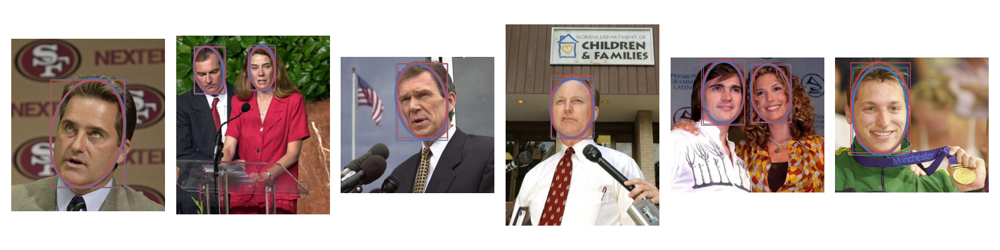
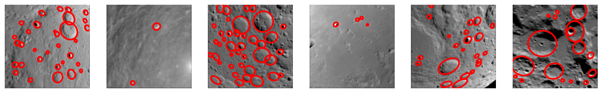
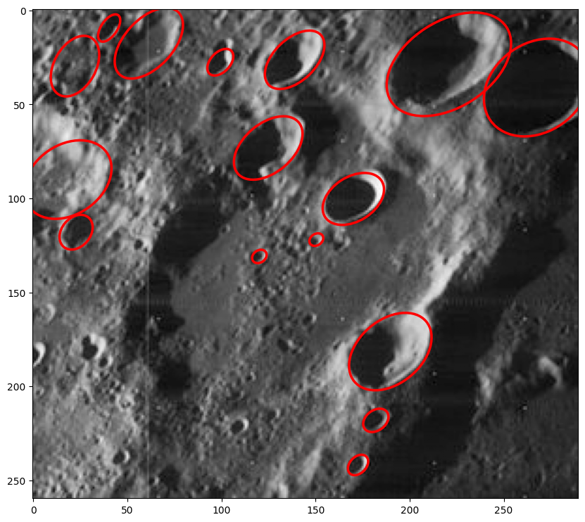

<div align="center">

<a href="https://pytorch.org/get-started/locally/"></a>
<a href="https://pytorchlightning.ai/"></a>

# Ellipse R-CNN

</div>

A PyTorch (Lightning) implementation of Ellipse R-CNN. Extracted from [another project](https://github.com/wdoppenberg/crater-detection).
The methodology is based on [Ellipse R-CNN: Learning to Infer Elliptical Object from Clustering and Occlusion](https://arxiv.org/abs/2001.11584), albeit
with slight changes. Primarily this implementation was made to enable Crater detection from Moon orbiter sensors, but
works with the [Face Detection Dataset & Benchmark](https://www.kaggle.com/datasets/cormacwc/fddb-dataset) (FDDB) dataset as well.

<div align="center">




</div>

## Installation

```shell
pip install ellipse-rcnn
```

### Optional extras

Enable a feature with the `ellipse-rcnn[<FEATURE>, ...]` pattern.

* `train`: Installs all dependencies necessary to train this model.
* `hf`: Installs `huggingface-hub` and `safetensors` for easy weights saving & loading through the Huggingface platform.


## Quickstart

* Install with all extras through `pip install "ellipse-rcnn[hf,train]"`
* Select the weights you need from my [Huggingface profile](https://huggingface.co/wdoppenberg).

Run the following:

```python
import torch
from ellipse_rcnn.hf import EllipseRCNN  # This is the model with HF functionality included through PyTorchModelHubMixin
from PIL import Image
from torchvision.transforms.functional import to_tensor
from ellipse_rcnn.utils.viz import plot_single_pred


model = EllipseRCNN.from_pretrained("MJGT/ellipse-rcnn-FDDB")  # For the FDDB face detection model
model.eval()

png = Image.open("docs/example_craters.png").convert("L")
img = to_tensor(png)
with torch.no_grad():
    pred = model([img])

plot_single_pred(img, pred)
```

This should output the following:

<div align="center">

# TODO: cambiar imagen


</div>

## Test-Time Augmentation (TTA) Implementation

This repository includes a comprehensive **Test-Time Augmentation (TTA)** implementation designed to improve ellipse detection performance through intelligent prediction consensus and quality-aware transformation ranking.

### TTA Core Implementation (`tta/`)

The main TTA implementation is located in the `tta/` folder:

- **`tta_transforms.py`**: Core TTA functionality with quality-aware consensus algorithms
  - Implements hierarchical fallback strategies for robust prediction consensus
  - Features transform quality scoring and spatial clustering
  - Includes advanced consensuation mechanisms for ellipse predictions

### TTA Configuration Optimization (`tta_config/`)

The `tta_config/` folder provides tools for optimizing TTA configuration parameters:

- **`configurations.py`**: Predefined configuration sets for different use cases
- **`tta_configuration_evaluator.py`**: Systematic evaluation of TTA parameter combinations
- **`results_analyzer.py`**: Analysis tools for configuration evaluation results
- **`results/`**: Comprehensive evaluation results and performance comparisons

### TTA Evaluation and Analysis (`tta_evaluation_analysis/`)

Comprehensive evaluation suite for TTA performance analysis:

- **`tta_global_errors_evaluation.py`**: Global error metrics analysis comparing base model vs TTA
- **`tta_fp_fn_analysis.py`**: False positive/false negative analysis with precision-recall curves
- **`complex_cases_analysis.py`**: Specialized analysis for challenging cases where base model fails
  - Identifies complex failure modes (FP, FN, high-error cases)
  - Runs both error analysis and FP/FN analysis on identical image subsets
  - Provides comprehensive improvement rate calculations

### TTA Optimization (`tta_optimization/`)

Advanced optimization tools for TTA transformations and parameters:

- **`tta_analysis.py`**: Comprehensive TTA performance analysis
- **`fddb_partitioner.py`**: Dataset partitioning for cross-validation studies
- **`extract_errors.py`**: Error extraction and analysis utilities
- **`tta_transforms.py`**: Optimized transformation implementations

### Error Metrics (`error_utils/`)

Sophisticated ellipse error calculation utilities based on established geometric principles:

- **`ellipse_errors.py`**: Algebraic, natural, and geometric error calculations
- **`ellipse_conversions.py`**: Conversion between different ellipse parameterizations
- **`ellipse_utils.py`**: General ellipse manipulation utilities

The error functions support multiple ellipse representations and provide:
- **Algebraic Error**: Distance in algebraic parameter space
- **Natural Error**: Perceptually meaningful geometric differences  
- **ParG Errors**: Individual parameter errors (center, angle, axes, area)

### Usage Example with TTA

```python
import torch
from ellipse_rcnn.hf import EllipseRCNN
from tta.tta_transforms import tta_predict
from PIL import Image
from torchvision.transforms.functional import to_tensor

model = EllipseRCNN.from_pretrained("MJGT/ellipse-rcnn-FDDB")
model.eval()

image = Image.open("your_image.png").convert("L")
img_tensor = to_tensor(image)

# TTA prediction with consensus
with torch.no_grad():
    tta_predictions = tta_predict(
        model=model, 
        image_tensor=img_tensor, 
        device=torch.device("cuda"),
        min_score=0.7,
        consensuate=True
    )
```


## Training Setup

Make sure you have [uv](https://docs.astral.sh/uv/getting-started/installation/) installed. This library's dependencies have mostly
been made optional to make it easy to import the base `EllipseRCNN` model. For training,
more dependencies, most importantly `pytorch-lightning`, are under the `train` group.

For a training setup, run the following from the project root:

```shell
uv sync --extra train
```

This sets up a new virtual environment and installs all packages into it.

Get info on either the training or sample (prediction) script using:

```shell
uv run scripts/train.py --help
# or
uv run scripts/sample.py --help
```

If you want to do experiment tracking, use tensorboard:

```shell
uvx tensorboard --logdir=lightning_logs
```

# Data

Currently the training script only supports training with FDDB. See the required steps for
getting & structuring the data below. More datasets can be supported if needed.
If you want to download a dataset directly, use the following script:

```shell
uv run scripts/download.py <DATASET_NAME> [Optional: --root <ROOT_FOLDER>]
```

## TTA Evaluation Scripts

The repository includes several evaluation scripts for comprehensive TTA analysis:

### Global Error Analysis
```shell
python tta_evaluation_analysis/tta_global_errors_evaluation.py --num_images 100 --min_score 0.7
```

### False Positive/False Negative Analysis  
```shell
python tta_evaluation_analysis/tta_fp_fn_analysis.py --num_images 100 --min_score 0.7
```

### Complex Cases Analysis
```shell
python tta_evaluation_analysis/complex_cases_analysis.py --scan_images 200 --min_score 0.7
```

### TTA Configuration Optimization
```shell
python tta_config/tta_configuration_evaluator.py --num_images 50
```

All evaluation scripts generate detailed results with visualizations and JSON output files for further analysis.

## FDDB Data

The [Face Detection Dataset & Benchmark](https://www.kaggle.com/datasets/cormacwc/fddb-dataset) (FDDB) [module](ellipse_rcnn/data/fddb.py) contains the `Dataset` subclass that does all the data loading and
transformations. It will download and unpack the necessary files to `./data/FDDB`. Simply running the training
script will download the necessary files.
